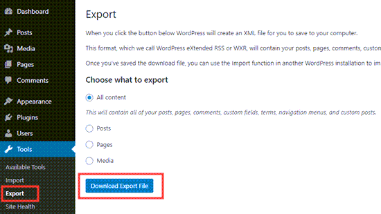
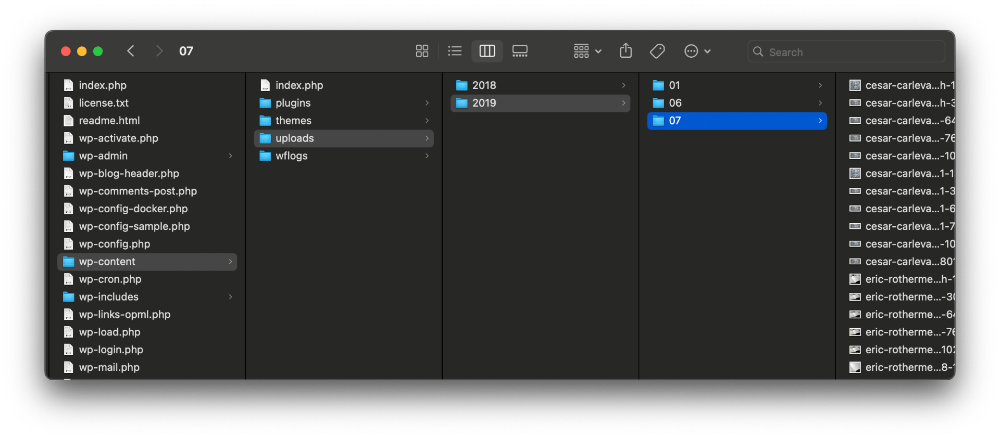

<p align="center">
    
</p>
<h1 align="center">ContributeWordPress</h1>

Import your WordPress site into Publish.

[](https://swift.org)
[](http://twitter.com/brightdigit)


[](https://swiftpackageindex.com/brightdigit/ContributeWordPress)
[](https://swiftpackageindex.com/brightdigit/ContributeWordPress)


[](https://codecov.io/gh/brightdigit/ContributeWordPress)
[](https://www.codefactor.io/repository/github/brightdigit/ContributeWordPress)
[](https://codebeat.co/projects/github-com-brightdigit-ContributeWordPress-main)
[](https://codeclimate.com/github/brightdigit/ContributeWordPress)
[](https://codeclimate.com/github/brightdigit/ContributeWordPress)
[](https://codeclimate.com/github/brightdigit/ContributeWordPress)
[](https://houndci.com)

# Table of Contents

* [Introduction](#introduction)
   * [Requirements](#requirements)
   * [Installation](#installation)
   * [How It Works](#how-it-works)
   * [Exporting from WordPress](#exporting-from-wordpress)
* [Usage](#usage)
   * [Getting Started](#getting-started)
   * [Exporting to Publish](#exporting-to-publish)
   * [Dowloading Resources from Active Site](#dowloading-resources-from-active-site)
   * [Copy Resources from Local Backup](#copy-resources-from-local-backup)
   * [Converting Posts to Markdown](#converting-posts-to-markdown)
   * [Using ShellOut and Pandoc for Markdown](#using-shellout-and-pandoc-for-markdown)
   * [Filtering Posts](#filtering-posts)
   * [Redirecting Old URLs](#redirecting-old-urls)
   * [Using SwiftArgumentParser for Settings](#using-swiftargumentparser-for-settings)
   * [Further Documentation](#further-documentation)
* [License](#license)

# Introduction

**ContributeWordPress** provides an undis manus herbarum Theseus? Et **graves**, ille? Genusque non
quatenus [suos Hippodamen](http://www.mersitquemagnae.com/superetque.php)

## Requirements 

**Apple Platforms**

- Xcode 14.3.1 or later
- Swift 5.8 or later
- iOS 14 / watchOS 7 / tvOS 14 / macOS 12 or later deployment targets

**Linux**

- Ubuntu 18.04 or later
- Swift 5.8 or later

## Installation

Use the Swift Package Manager to install this library via the repository url:

```
https://github.com/brightdigit/ContributeWordPress.git
```

Use version up to `1.0.0`.

## How It Works

**ContributeWordPress** uses the exported XML (also referred to as WXR file) to import content into your existing **Publish** site. 

```swift
import ContributeWordPress

let fromURL = URL(
    fileURLWithPath: "directory/containing/your/export/xml/files"
)
let toURL = URL(
    fileURLWithPath: "Path/to/Publish/root"
)

try MarkdownProcessor.beginImport(
    from: fromURL, 
    to: toURL
)
```

In order to begin, you need:

* The exported **XML file** 
* The active WordPress site or a complete download of the site's files (for the images on your site)

## Exporting from WordPress

**ContributeWordPress** needs a backup XML file from your **WordPress** site. To do this:

1. Login to your WordPress Administration Dashboard.
2. Go to Tools... Export:

3. Download your export file by:
    * Clicking the Export All button (if you have a site without plugins installed.)
    * Selecting all content and clicking the Download Export File button (if you have a site with plugins installed.)
    * Download specific content only, like posts, pages, or feedback.
4. You will receive a .zip file to save to your computer with the .xml file inside of it. This file contains your posts, pages, comments, categories, tags, and references to your site’s images.

Larger sites will include more than one XML file to ensure that your export process will be fast and complete successfully, for instance if you are running multi-site **WordPress**. Luckily **ContributeWordPress** supports importing multiple xml files! When importing the BrightDigit website, the content was importing for the learningswift.brightdigit.com into brightdigit.com/tutorials and brightdigit.com into brightdigit.com/articles.

For more details on the export process, please read [the documentation on the **WordPress** site.](https://wordpress.com/support/export/)

# Usage

## Getting Started

Besides exporting your **WordPress site**, you need access to the images by either:
* downloading directly from the site
* having a copy of the site's files



Once you have both components, [you need to setup a **Publish** site]((https://github.com/JohnSundell/Publish)). There are several great tutorials online:

* [JohnSundell/Publish: A static site generator for Swift developers](https://github.com/JohnSundell/Publish)
* [How to Create a Personal Website in Swift using Publish | Danijela's blog](https://www.danijelavrzan.com/posts/2022/06/create-portfolio-website-using-publish/)
* [Static Site Generation with Swift using Publish, Plot and Ink](https://www.createwithswift.com/static-site-generation-with-swift-using-publish/)
* [Getting started with static-site generation in Swift using Publish | Andy Regensky](https://andyregensky.dev/articles/publish-getting-started/)

Once the site is setup, we can:

* convert and translate the HTML inside your exported XML (also referred to as WXR file) to Markdown files inside your _Content_ directory
* download (or copy) your images and other files inside your WordPress upload folder to your _Resources_ directory
## Exporting to Publish

The simplest way to import your **WordPress** site is by just passing the path to your xml files as well as the root of your **Publish** site.

```swift
import ContributeWordPress

let fromURL = URL(
    fileURLWithPath: "directory/containing/your/export/xml/files"
)
let toURL = URL(
    fileURLWithPath: "Path/to/Publish/root"
)

try MarkdownProcessor.beginImport(
    from: fromURL, 
    to: toURL
)
```

If you wish to create a small command line application you can take in command line arguments for the two paths:

```swift
import ContributeWordPress

let fromURL : URL
let toURL : URL

guard CommandLine.arguments.count == 2 else {
  exit(1)
}

fromURL = .init(fileURLWithPath: CommandLine.arguments[0])
toURL = .init(fileURLWithPath: CommandLine.arguments[1])

try! MarkdownProcessor.beginImport(from: fromURL, to: toURL)
```

## Dowloading Resources from Active Site

By default, **ContributeWordPress** will download the images from your active **WordPress** site. Therefore if it comes across a reference to url to your site it will change the url to the new address it will be imported to.

Therefore HTML from your exports file will change from:

```html
<figure class="wp-block-image"><figcaption>A JavaScript Meetup I hosted in 2018 </figcaption></figure>
```

to this in your markdown file:

```html
<figure class="wp-block-image">

<figcaption>A JavaScript Meetup I hosted in 2018</figcaption>
</figure>
```

## Copy Resources from Local Backup


If your site is no longer active but you have a local copy of the site, you can pass in that directory to be used instead.

Let's expand on our previous command line example by adding an optional parameter:

```swift
let fromURL : URL
let toURL : URL

let importAssetsSetting : AssetImportSetting

guard CommandLine.arguments.count >= 2 else {
  exit(1)
}

fromURL = URL(fileURLWithPath: CommandLine.arguments[0])
toURL = URL(fileURLWithPath: CommandLine.arguments[1])

// if a third argument is passed
if CommandLine.arguments.count > 2 {
  // assume they want to copy the resources directly
  importAssetsSetting = .copyFilesFrom(
    URL(fileURLWithPath: CommandLine.arguments[2])
  )
} else {
  // otherwise use the default `download` option
  importAssetsSetting = .download
}

try! MarkdownProcessor.beginImport(
  from: fromURL,
  to: toURL,
  importAssetsBy: importAssetsSetting
)

```

Therefore you can call:

```bash
> wpublish \
  directory/with/export/xml/files \
  Path/to/Publish/root \
  path/to/root/wordpress/files
```

The `AssetImportSetting` option contains three options:
* `none` - don't do anything
* `download` - download them from the WordPress site
* `copyFilesFrom(URL)` - copy the files from a local mapped location

## Converting Posts to Markdown

By default, **ContributeWordPress** doesn't implement any specific method to convert HTML from your WordPress posts to markdown. 

However there are a few easy to use implementations as well the ability to plug in your own.

Specifically this can done by passing a `MarkdownGenerator` to the processor:

```swift
try! MarkdownProcessor.beginImport(
  from: fromURL,
  to: toURL,
  usingGenerator: // your `MarkdownGenerator` here,
  importAssetsBy: importAssetsSetting
)
```

`MarkdownGenerator` is a simple protocol from the **Contribute** base library which takes an HTML `String` and returns a new markdown `String`.

```swift
/// A protocol for generating Markdown from HTML.
public protocol MarkdownGenerator {
  /// Converts an HTML string to Markdown.
  ///
  /// - Parameter htmlString: The HTML string to convert.
  /// - Returns: The generated Markdown string.
  /// - Throws: An error if the conversion fails.
  func markdown(fromHTML htmlString: String) throws -> String
}
```

By default, we use the `PassthroughMarkdownGenerator` which does nothing. However you can implement your own or use `HTMLtoMarkdown` to pass in a closure.

## Using ShellOut and Pandoc for Markdown

If you wish to convert the HTML from your WordPress posts to Markdown, the recommended solution is to use the `PanddocMarkdownGenerator` included with the **Contribute** library. The `PanddocMarkdownGenerator` requires the **ShellOut** library to run an installation of **Pandoc**.

The recommended way to install **Pandoc** on your machine is via homebrew:

```bash
> brew install pandoc
```

Once **Pandoc** is installed, you can run the command as part of your import using **ShellOut**.

Here is a simple code snippet for using plugging in **ShellOut**:

```swift
extension PandocMarkdownGenerator {
  public static func defaultShellOut(to command: String, arguments: [String]) throws -> String {
    try ShellOut.shellOut(to: command, arguments: arguments)
  }
  
  public init (temporaryFile: @escaping (String) throws -> URL = Temporary.file(fromContent:)) {
    self.init(shellOut: Self.defaultShellOut(to:arguments:), temporaryFile: temporaryFile)
  }
}
```

From here we can now simply use the `PandocMarkdownGenerator` to convert our WordPress HTML to markdown:

```swift
try! MarkdownProcessor.beginImport(
  from: fromURL,
  to: toURL,
  usingGenerator: PandocMarkdownGenerator(),
  importAssetsBy: importAssetsSetting
)
```

## Filtering Posts

The export files from WordPress contain a plethora of information including non-published posts as well as non-post items. **By default, the import filters for only published posts.** These are set using the `RegexKeyPostFilter` type which takes in a `KeyPath` of a `WordPressPost` property with a `String` type from the `SyndiKit` library and a `NSRegularExpression`.

Here's the example for the default `RegexKeyPostFilter` items:

```swift
    [
        RegexKeyPostFilter(pattern: "post", keyPath: \.type),
        RegexKeyPostFilter(pattern: "publish", keyPath: \.status)
    ]
```

Additionally you can implement your own `PostFilter` of any kind and pass it in:

```swift
try! MarkdownProcessor.beginImport(
  from: fromURL,
  to: toURL,
  filteringPostsWith: // array of `PostFilter` items
  importAssetsBy: importAssetsSetting
)
```

## Redirecting Old URLs

If you are migrating from **WordPress** to a **Publish** site, probably need to redirect several old urls to you new site. This can be done by passing a `RedirectFormatter`. This requires two methods to be implemented:

* `formatRedirects` which takes a collection of `RedirectItem` object (i.e. old URL, new URL) and expects a single string which will be written out somehere.
* `redirectsURL(basedOnResourcesDirectoryURL:)` which returns the url for the file which that `String` needs to be written.

By default no redirect file is exported so you'll need to supply your own if needed. Otherwise, only **Netlify** is supported via `NetlifyRedirectFormatter`. More granular control is available via the `RedirectFileWriter` if needed. 

Feel free to post an issue or pull request for your own implementations or questions.

## Using SwiftArgumentParser for Settings

While you may wish the parse the arguments yourself using the `CommandLine` object, it is highly recommended you use the **Swift Argument Parser** for more complex options.

Feel free to check out [the example here](https://github.com/leogdion/leogdion.name/blob/main/Sources/LeoGDionNameArgs/Commands/Import/WordPress.swift).

## Further Documentation

Further documentation is available at [the Swift Package Index.](https://swiftpackageindex.com/brightdigit/ContributeWordPress/1.0.0/documentation/ContributeWordPress)

# License 

This code is distributed under the MIT license. See the [LICENSE](https://github.com/brightdigit/ContributeWordPress/LICENSE) file for more info.
