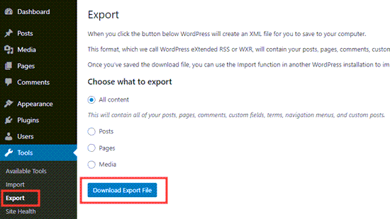
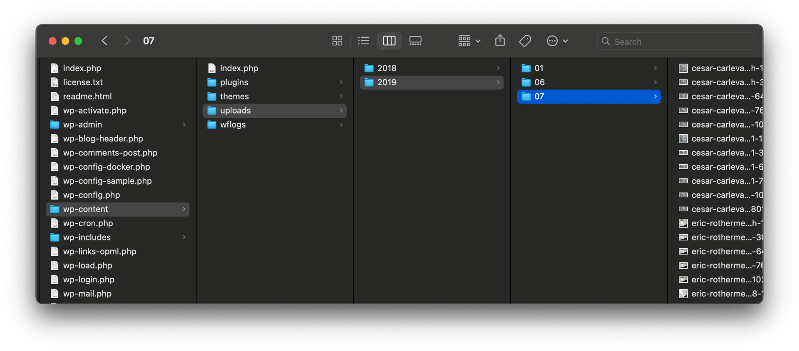

# ContributeWordPress


[](https://swiftpackageindex.com/brightdigit/ContributeWordPress)
[](https://swiftpackageindex.com/brightdigit/ContributeWordPress)
[](https://swiftpackageindex.com/brightdigit/ContributeWordPress/documentation)
[](LICENSE)
[](https://github.com/brightdigit/ContributeWordPress/actions)
[](https://qlty.sh/gh/brightdigit/projects/ContributeWordPress)
[](https://codecov.io/gh/brightdigit/ContributeWordPress)
[](https://www.codefactor.io/repository/github/brightdigit/ContributeWordPress)

Import your WordPress site into Publish.

---

## What is ContributeWordPress?

Migrating off WordPress means moving two things: the posts and the media that goes with them.
WordPress hands you the first as a **WXR export** — one or more XML files full of HTML post
bodies — and leaves the second sitting in `wp-content/uploads` on a server you're about to turn
off.

**ContributeWordPress turns that pair into a ready-to-build [Publish](https://github.com/JohnSundell/Publish)
site**: Markdown files with YAML front matter in your `Content/` directory, images copied or
downloaded into your `Resources/` directory with their URLs rewritten to match, and — optionally
— a redirect file so your old permalinks keep working.

It is built on [Contribute](https://github.com/brightdigit/Contribute) (the generic
source → markdown pipeline) and [SyndiKit](https://github.com/brightdigit/SyndiKit) (which
decodes the WXR file). Multi-site exports are supported: point it at a directory of XML files and
each site maps to its own section. `brightdigit.com` was migrated this way — `brightdigit.com`
into `/articles` and `learningswift.brightdigit.com` into `/tutorials`.

The package ships a library and a small `wpublish` executable that wraps it.

## Installation

Add ContributeWordPress to your `Package.swift`:

```swift
dependencies: [
  .package(url: "https://github.com/brightdigit/ContributeWordPress.git", from: "1.0.0-alpha.1")
]
```

Then add it to a target:

```swift
.target(
  name: "MySiteImporter",
  dependencies: [.product(name: "ContributeWordPress", package: "ContributeWordPress")]
)
```

## Usage

### Exporting from WordPress

ContributeWordPress needs a backup XML file (WXR) from your WordPress site:

1. Log in to your WordPress Administration Dashboard.
2. Go to **Tools → Export**:
   
3. Download your export file by either clicking **Export All**, selecting all content and
   clicking **Download Export File**, or exporting specific content only (posts, pages, feedback).
4. You'll get a `.zip` containing the `.xml` file — your posts, pages, comments, categories,
   tags, and references to your site's images.

Larger sites export as more than one XML file; ContributeWordPress imports a whole directory of
them. For more detail see [the WordPress export documentation](https://wordpress.com/support/export/).

You also need access to the images, by either downloading them from the live site or keeping a
copy of the site's files:



### Importing into Publish

The simplest import passes the path to your XML files and the root of your Publish site:

```swift
import ContributeWordPress

let fromURL = URL(fileURLWithPath: "directory/containing/your/export/xml/files")
let toURL = URL(fileURLWithPath: "Path/to/Publish/root")

try MarkdownProcessor.beginImport(from: fromURL, to: toURL)
```

The bundled `wpublish` executable does exactly this from the command line:

```bash
wpublish \
  directory/with/export/xml/files \
  Path/to/Publish/root \
  path/to/root/wordpress/files   # optional
```

### Downloading vs. copying assets

By default ContributeWordPress **downloads** images from the live WordPress site, rewriting each
reference to its new location. So HTML in your export like:

```html
<figure class="wp-block-image"></figure>
```

becomes, in your markdown file:

```html
<figure class="wp-block-image">

</figure>
```

If the site is already offline but you have a local copy of its files, pass that directory
instead. `AssetImportSetting` has three cases:

* `none` — do nothing
* `download` — fetch them from the live WordPress site (the default)
* `copyFilesFrom(URL)` — copy them from a local directory

```swift
try MarkdownProcessor.beginImport(
  from: fromURL,
  to: toURL,
  importAssetsBy: .copyFilesFrom(URL(fileURLWithPath: "path/to/wordpress/files"))
)
```

### Converting HTML to Markdown

By default the post body is passed through unchanged (`PassthroughMarkdownGenerator`). To
actually convert the WordPress HTML, use `SwiftSoupMarkdownGenerator` from the **Contribute**
library — it converts in-process with SwiftSoup and swift-markdown, so there is no `pandoc` to
install and it works on Linux and CI:

```swift
try MarkdownProcessor.beginImport(
  from: fromURL,
  to: toURL,
  usingGenerator: SwiftSoupMarkdownGenerator(),
  importAssetsBy: importAssetsSetting
)
```

Any type conforming to Contribute's `MarkdownGenerator` works, and `HTMLtoMarkdown` wraps a
plain closure:

```swift
public protocol MarkdownGenerator {
  func markdown(fromHTML htmlString: String) throws -> String
}
```

### Filtering posts

A WXR export contains far more than published posts. **By default the import keeps only
published posts**, via `RegexKeyPostFilter`, which pairs a `KeyPath` on SyndiKit's
`WordPressPost` with a regular expression:

```swift
[
  RegexKeyPostFilter(pattern: "post", keyPath: \.type),
  RegexKeyPostFilter(pattern: "publish", keyPath: \.status)
]
```

Supply your own `PostFilter` values to change that:

```swift
try MarkdownProcessor.beginImport(
  from: fromURL,
  to: toURL,
  filteringPostsWith: myFilters,
  importAssetsBy: importAssetsSetting
)
```

### Redirecting old URLs

Migrating permalinks usually means emitting a redirect file. Implement `RedirectFormatter`:

* `formatRedirects(_:)` — takes the `RedirectItem` values (old URL, new URL) and returns the file
  contents.
* `redirectsURL(basedOnResourcesDirectoryURL:)` — returns where that string is written.

No redirect file is written unless you supply a formatter. `NetlifyRedirectFormatter` ships in
the box; `RedirectFileWriter` gives finer control.

### Parsing settings

For anything beyond two or three arguments, use
[Swift Argument Parser](https://github.com/apple/swift-argument-parser) rather than reading
`CommandLine` directly — see
[this example](https://github.com/leogdion/leogdion.name/blob/main/Sources/LeoGDionNameArgs/Commands/Import/WordPress.swift).

Full API documentation is on
[the Swift Package Index](https://swiftpackageindex.com/brightdigit/ContributeWordPress/documentation).

## Requirements

- Swift 6.4+
- macOS 15+, iOS 16+, tvOS 16+, watchOS 9+
- Linux (Ubuntu 24.04 "Noble"), Windows, and Android are covered by CI

## License

[MIT](LICENSE) © BrightDigit
